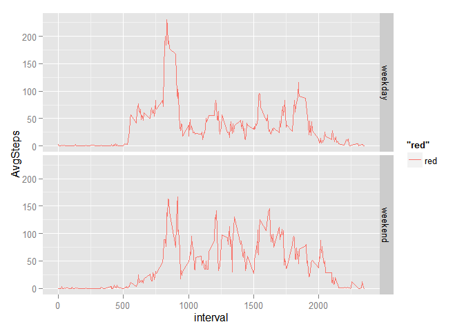

RR_Course Project One, McDavid
=========================================================

---
title: "RR_ Course Project One"
author: "JCM"
date: "January 10, 2016"
output: html_document
---


 ReproRsrch_Project One.R, John C. McDavid, 01-07-2016
   Course Project One
   Rev last 01-10-2016
   R vers 3.2.2 Fire Safety

# Project & Analysis Description

 This assignment makes use of data from a personal activity monitoring device. This device collects data at
 5 minute intervals through out the day. The data consists of two months of data from an anonymous individual
 collected during the months of October and November, 2012 and include the number of steps taken in 5 minute
 intervals each day.

 The data for this assignment can be downloaded from the course web site:
    .Dataset: Activity monitoring data [52K]

 The variables included in this dataset are:
    .steps: Number of steps taking in a 5-minute interval (missing values are coded as NA)
    .date: The date on which the measurement was taken in YYYY-MM-DD format
    .interval: Identifier for the 5-minute interval in which measurement was taken

 The dataset is stored in a comma-separated-value (CSV) file and there are a total of 17,568 observations in
 this dataset.

# Loading of Data
set working directory
setwd("C:\\Users\\jcmcd\\Coursera - Reproducible Research")        # set desired working dir

read in data from csv file

```r
activity <- read.csv("./data/activity.csv", header = TRUE)
str(activity)
```

```
## 'data.frame':	17568 obs. of  3 variables:
##  $ steps   : int  NA NA NA NA NA NA NA NA NA NA ...
##  $ date    : Factor w/ 61 levels "2012-10-01","2012-10-02",..: 1 1 1 1 1 1 1 1 1 1 ...
##  $ interval: int  0 5 10 15 20 25 30 35 40 45 ...
```

# Mean Total Steps per Day
calculate total number of steps per day

```r
hsum <- tapply(activity$steps, activity$date, FUN = sum, na.rm = TRUE)
```

histogram of steps per day

```r
hist(hsum, col = "green", breaks = 10, ylim = c(0, 20), main = "Histogram of Avg Total Steps per Day", xlab = "Total steps per day")
```

 

report mean and median number of steps per day across days

```r
mean(hsum)
```

```
## [1] 9354.23
```

```r
median(hsum)
```

```
## [1] 10395
```

# Average Daily Activity Pattern
calculate mean steps by 5 min interval

```r
library(dplyr)
```

```
## 
## Attaching package: 'dplyr'
## 
## The following objects are masked from 'package:stats':
## 
##     filter, lag
## 
## The following objects are masked from 'package:base':
## 
##     intersect, setdiff, setequal, union
```

```r
stepsmean <- activity %>% filter(!is.na(steps)) %>% group_by(interval) %>% summarize(AvgSteps = mean(steps))
```

make time series line plot of of 5 minute interval (x) and average number of steps taken (y) across all days

```r
with(stepsmean, plot(interval, AvgSteps, type = "l", ylab = "Mean Steps By Interval", xlab = "Minute Interval"))
```

 

find which 5 minute interval on average has maximum number of steps

```r
stepsmean[which.max(stepsmean$AvgSteps),1]
```

```
## Source: local data frame [1 x 1]
## 
##   interval
##      (int)
## 1      835
```

# Imputing Missing Values, Create New Dataset
total number of missing values in dataset, and percentage of missing values

```r
sum(is.na(activity$steps))
```

```
## [1] 2304
```

```r
mean(is.na(activity$steps))
```

```
## [1] 0.1311475
```

Strategy:  replace missing values at each 5 min interval with average number of steps for interval across all days
do this by merging Avg Steps into dataset, arrange back to date and interval, then replace missing value with Average

```r
actmerge <- merge(activity, stepsmean, by = "interval", sort = FALSE)
actmerge2 <- arrange(actmerge, date, interval)
head(actmerge2)
```

```
##   interval steps       date  AvgSteps
## 1        0    NA 2012-10-01 1.7169811
## 2        5    NA 2012-10-01 0.3396226
## 3       10    NA 2012-10-01 0.1320755
## 4       15    NA 2012-10-01 0.1509434
## 5       20    NA 2012-10-01 0.0754717
## 6       25    NA 2012-10-01 2.0943396
```

```r
for (i in 1:nrow(activity)) {
     if (is.na(actmerge2[i,2])) { actmerge2[i,2] <- actmerge2[i,4]}
      }
head(actmerge2)
```

```
##   interval     steps       date  AvgSteps
## 1        0 1.7169811 2012-10-01 1.7169811
## 2        5 0.3396226 2012-10-01 0.3396226
## 3       10 0.1320755 2012-10-01 0.1320755
## 4       15 0.1509434 2012-10-01 0.1509434
## 5       20 0.0754717 2012-10-01 0.0754717
## 6       25 2.0943396 2012-10-01 2.0943396
```

sum steps per day (by date)

```r
stepsperday <- actmerge2 %>% filter(!is.na(steps)) %>% group_by(date) %>% summarize(SumDaySteps = sum(steps))
head(stepsperday)
```

```
## Source: local data frame [6 x 2]
## 
##         date SumDaySteps
##       (fctr)       (dbl)
## 1 2012-10-01    10766.19
## 2 2012-10-02      126.00
## 3 2012-10-03    11352.00
## 4 2012-10-04    12116.00
## 5 2012-10-05    13294.00
## 6 2012-10-06    15420.00
```

clean up date format, data frame clean-up

```r
stepsperday2 <- stepsperday
stepsperday2$date <- as.Date(as.character(stepsperday2$date), "%Y-%m-%d")
head(stepsperday2)
```

```
## Source: local data frame [6 x 2]
## 
##         date SumDaySteps
##       (date)       (dbl)
## 1 2012-10-01    10766.19
## 2 2012-10-02      126.00
## 3 2012-10-03    11352.00
## 4 2012-10-04    12116.00
## 5 2012-10-05    13294.00
## 6 2012-10-06    15420.00
```

```r
stepsperday2  <- data.frame(stepsperday2)
```

histogram of total number of steps taken each day

```r
library(ggplot2)
    # use this for hist of daily steps
    qplot(stepsperday2$SumDaySteps,
          geom="histogram",
          binwidth = 2000,
          main = "Histogram for Daily Steps", 
          xlab = "Daily Steps",  
          fill=I("blue"), 
          col=I("red"),
          alpha=I(.2),
          xlim=c(0,25000))
```

 
    
report mean and median total number of steps per day with filled in missing values

```r
mean(stepsperday2$SumDaySteps)
```

```
## [1] 10766.19
```

```r
median(stepsperday2$SumDaySteps)
```

```
## [1] 10766.19
```
mean and median changed slightly due to imputing missing data

# Differences in Activity Patterns Between Weekdays and Weekends
use previous dataset with imputed missing values, clean up date format, create variable with day name

```r
actmerge3 <- actmerge2
actmerge3$date <- as.Date(as.character(actmerge3$date), "%Y-%m-%d")
head(actmerge3)
```

```
##   interval     steps       date  AvgSteps
## 1        0 1.7169811 2012-10-01 1.7169811
## 2        5 0.3396226 2012-10-01 0.3396226
## 3       10 0.1320755 2012-10-01 0.1320755
## 4       15 0.1509434 2012-10-01 0.1509434
## 5       20 0.0754717 2012-10-01 0.0754717
## 6       25 2.0943396 2012-10-01 2.0943396
```

```r
str(actmerge3)
```

```
## 'data.frame':	17568 obs. of  4 variables:
##  $ interval: int  0 5 10 15 20 25 30 35 40 45 ...
##  $ steps   : num  1.717 0.3396 0.1321 0.1509 0.0755 ...
##  $ date    : Date, format: "2012-10-01" "2012-10-01" ...
##  $ AvgSteps: num  1.717 0.3396 0.1321 0.1509 0.0755 ...
```

```r
actmerge3$wkdy <- weekdays(actmerge3$date)
```

create variable dow to identify weekday or weekend, add column name

```r
for (i in 1:nrow(actmerge3)) {
    if(actmerge3[i,5] == "Saturday" | actmerge3[i,5] == "Sunday") {actmerge3[i,6] = "weekend"} else {actmerge3[i,6] = "weekday"}
}
names(actmerge3)[6] <- "dow"
head(actmerge3)
```

```
##   interval     steps       date  AvgSteps   wkdy     dow
## 1        0 1.7169811 2012-10-01 1.7169811 Monday weekday
## 2        5 0.3396226 2012-10-01 0.3396226 Monday weekday
## 3       10 0.1320755 2012-10-01 0.1320755 Monday weekday
## 4       15 0.1509434 2012-10-01 0.1509434 Monday weekday
## 5       20 0.0754717 2012-10-01 0.0754717 Monday weekday
## 6       25 2.0943396 2012-10-01 2.0943396 Monday weekday
```

simplify dataframe, calc mean steps by interval and weekday/weekend

```r
actmerge4 <- actmerge3[,c(1:3,6)]
stepsmeanbydow <- actmerge4 %>% filter(!is.na(steps)) %>% group_by(interval, dow) %>% summarize(AvgSteps = mean(steps))
```

use ggplot2 to make panel plot of 5 min interval (x axis) and average number of steps taken, across all weekend or weekday days (y axis)

```r
library(ggplot2)

g <- ggplot(stepsmeanbydow, aes(x = interval, y = AvgSteps))
g + geom_line(aes(color = "red")) + facet_grid(dow ~ .)
```

 
